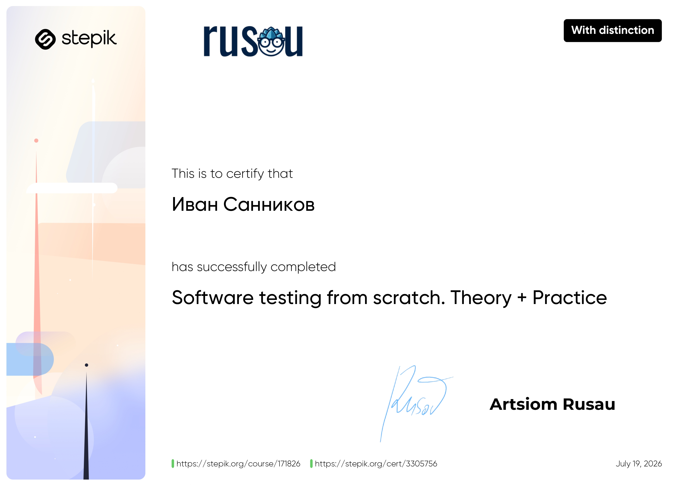
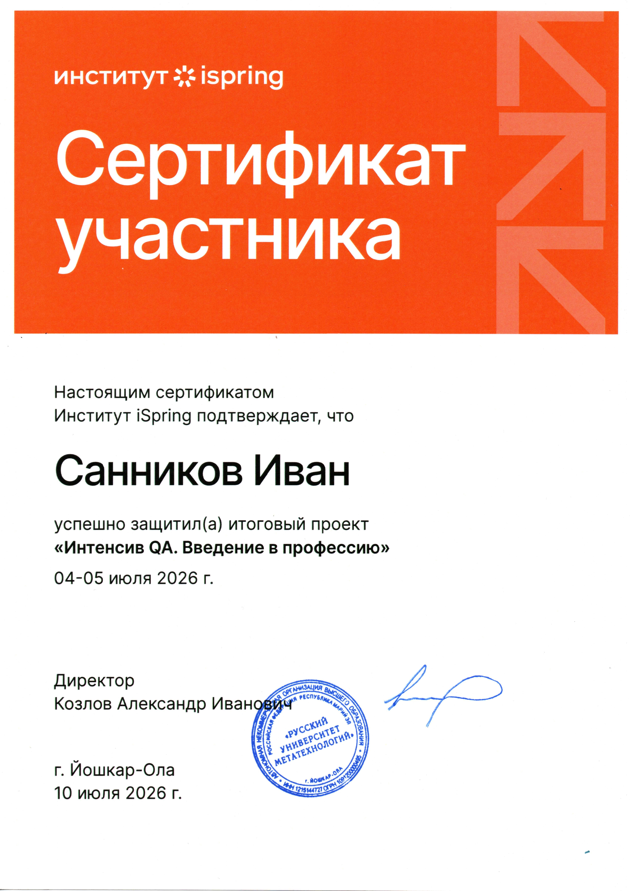

---

## 🎯 A little about me
I'm a manual QA engineer with hands-on experience testing mobile games — both single-player and multiplayer. 
I'm now expanding into general software QA and always looking to learn something new and apply it at work. 
My strongest soft skills are attention to detail, clear communication, and a creative approach to problem-solving. 
I enjoy digging into complex problems and polishing the final product until it's rock solid. 

---

## 🛠️ Languages and Tools

### 🎨 Programming languages

    

### 🧪 Testing tools

### 🏗️ Tools and Platforms

---

## 💼 Work Experience

**QA Engineer** — XenTech · Aug 2024 – Aug 2025

- Performed full-cycle manual testing of single-player and multiplayer mobile games
- Tested games across multiple devices (iOS, Android) and OS versions to ensure compatibility
- Identified, documented, and tracked bugs in Jira with video evidence and precise reproduction steps
- Tested application stability under unstable network conditions
- Participated in test planning; created and maintained test documentation in Qase and TestRail

---

## 🧪 QA Case Study: Employee Birthdays Module (iSpring Learn LMS)

A full QA case covering the "Employee Birthdays" module — from planning to reporting.

- Built a complete test plan and checklist (30 items across 5 groups)
- Wrote smoke test cases and detailed test cases with test design technique annotations
- Used Postman to send API requests and generate test data
- Found and reported 2 notable bugs: asymmetric birthdate validation and a documentation discrepancy on year visibility
- Delivered results as an HTML dashboard and a summary presentation

**Materials:** [Test Plan (PDF)](https://drive.google.com/file/d/1YMhho5qT9gpaGrsaABoo6rw3mrMwV1Tu/view?usp=sharing) · [Checklist, Test Cases & Bug Reports (Excel)](https://docs.google.com/spreadsheets/d/1nlcM130LrX7wPDGtP8hQFS4sXjLKeEX7/edit?rtpof=true&gid=1898801877#gid=1898801877) · [Presentation](https://drive.google.com/file/d/1zd1rGEUK8qHugXn2V6dhAVldc3rGdFHq/view?usp=sharing)

---

## 🌍 Languages i speak

---

## 📬 Let's get in touch here!

---

## My Certificates & Achievements

<table>
<tr>
<td width="60%">

</td>

<td width="40%">

</td>
</tr>
</table>
